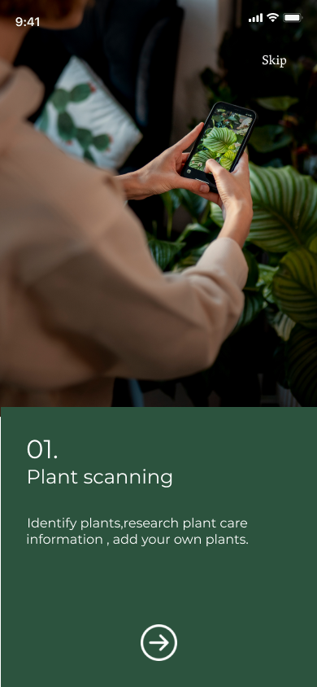
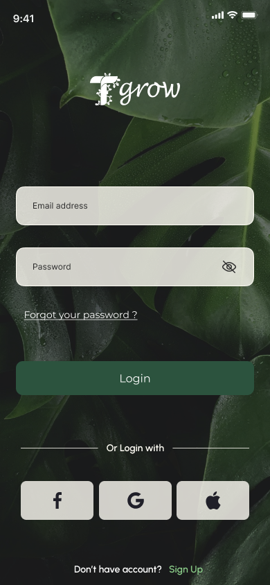
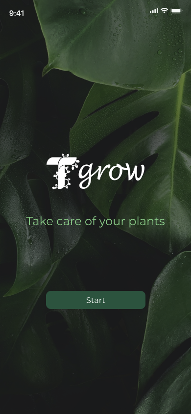
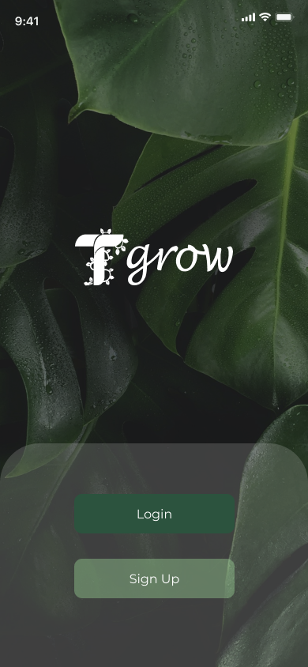
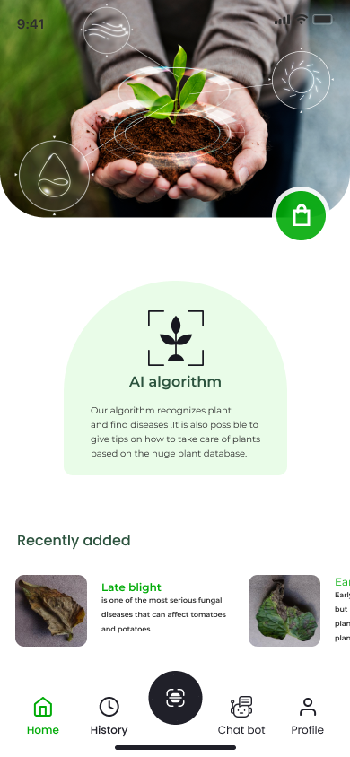
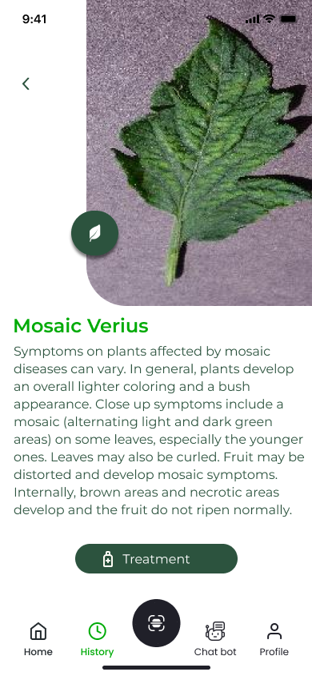
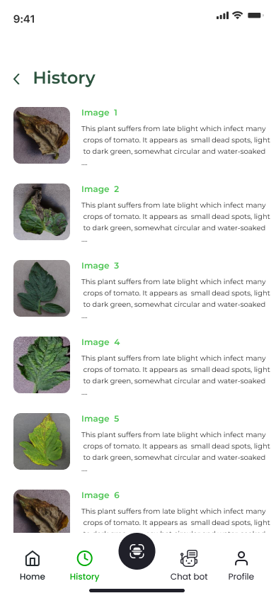
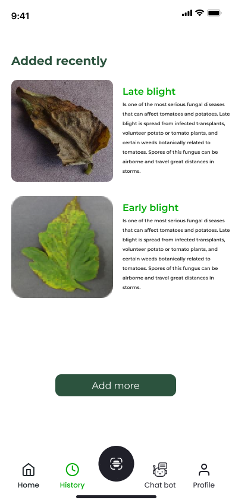
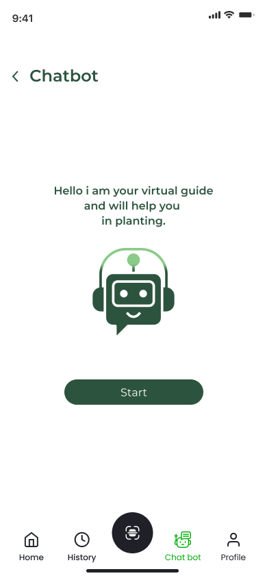

# t_grow

This is my graduation project .A smart application to identify diseases of tomato leaves and find suitable treatments, with the presence of a chatbot feature to inquire about some diseases or appropriate treatments.
# App Photos
## Onboarding Screens
.png)  
.png)  
.png)  
  

---

## Authentication
  
  

---## Main Screens
  
  
  
  

---

## Features
.png)  
.png)  
  
  
